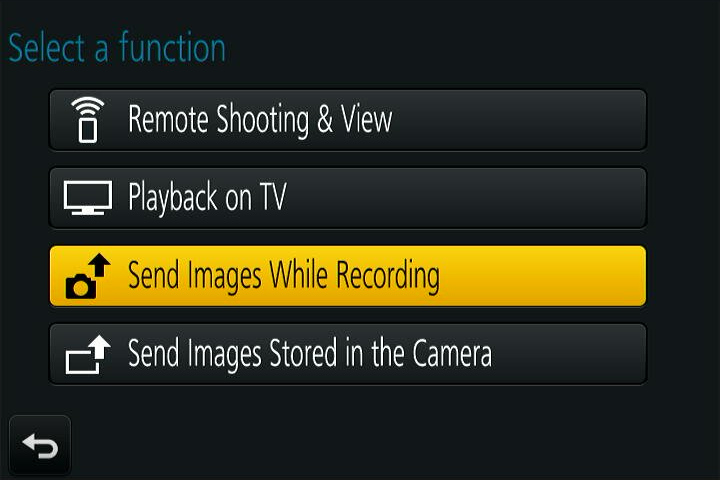

# Getting Started
Shutterlink uses a similar connection process to the official Panasonic app, however you may no longer have access to the original manual that came with your camera.
Panasonic actually provides free copies of most manuals, but for convenience I've created this guide.

Shutterlink supports two different connection methods: remote view and background connection.
* Remote view allows you to see and download the images stored on the camera.
* Background connection allows you to use the auto-send functionality of the  
camera to download images as you take them. You can optinally choose to send  
lower-quality images for sharing on social media.
---
## View and download stored images
Start by opening the menu on your camera. Navigate to the Wi-Fi sub-menu.

Your screen should look like this:

Open "Wi-Fi Function" and choose "New Connection" (even if you've already tried Panasonic's official app, a new connection is probably still required)

Choose "Remote Shooting and View"

The camera will prompt you to connect to its WiFi network with a screen like this one. Once you see this screen, you can continue this guide on your phone.

Open the Shutterlink app. You'll immediately be prompted to select a Wifi network to join. Connect to the camera's network and click "Done." If you accidentally close this box or don't see the camera's network, please connect to it from your phone settings instead. On many devices, you may need to choose "Stay connected" on your phone after connecting to the camera since the hotspot doesn't have internet access.

The camera screen should change to one that looks like this:

On your phone, select "Download Images from Camera" and click "Connect".

At this point, the camera should briefly flash "Under remote control" and image thumbnails will appear on the screen.

The camera is now connected. To download an image, tap on it. 

---
## Automatically Send Images as you Take Them
Start by opening the menu on your camera. Navigate to the Wi-Fi sub-menu.

Your screen should look like this:

Open "Wi-Fi Function" and choose "New Connection" (even if you've already tried Panasonic's official app, a new connection is probably still required)

From the resulting menu, choose "Send Images While Recording":

Select "Smartphone" as the destination

Shutterlink supports both regular wifi networks and the camera's hotspot. Since you will probably be using the auto-send functionality in the field, we will choose "Direct" as the connection method.

Choose "Manual Connection"

The camera will prompt you to connect to its WiFi network with a screen like this one. Once you see this screen, you can continue this guide on your phone.

Open the Shutterlink app. You'll immediately be prompted to select a Wifi network to join. Connect to the camera's network and click "Done." If you accidentally close this box or don't see the camera's network, please connect to it from your phone settings instead. On many devices, you may need to choose "Stay connected" on your phone after connecting to the camera since the hotspot doesn't have internet.

The camera screen should change to one that looks like this:

On your phone, select "Create Background Link" and click "Connect"

Your phohe will display "Searching for Camera" until it finds the camera, at which point it will attempt to pair. When you see "Connection Successful," check the camera to confirm the image settings. It may be several seconds until the camera recognizes the connection. Eventually, the camera will display this screen:

Select "Shutterlink," and wait a second until the camera displays a screen like this one:

Now, you can either change the image settings or leave them as-is. By default, the camera will send a half-resolution copy of the images you take. You can change this to send anything from 640x480 images to full-size originals. Medium quality typically provides good results without taking a long time to send images. Oce you have the settings set the way you like them, click "Set."

The camera is now connected. When you take a picture, a copy will automatically transfer to your gallery.

---
## Subsequent connections
The pairing processes above can be done at any time, but the camera will save the connection after you do it once. For subsequent connections, you can choose "Select a Destination from History" from the Wi-Fi menu

Then choose the connection from your connection history. In this picture, the auto-send connection is on top and the remote view connection is the bottom one. You can also save these connections as favorites in order to put them in the favorites menu. Once you select one of these options, the camera will display "Connecting....," at which point you can open the app and connect to the camera's hotspot.

